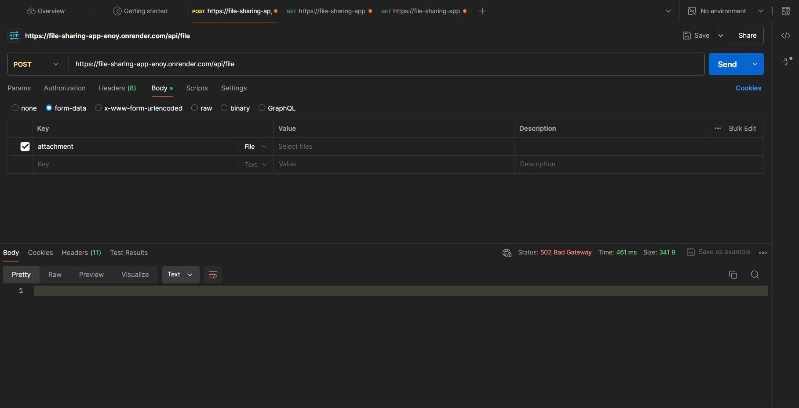
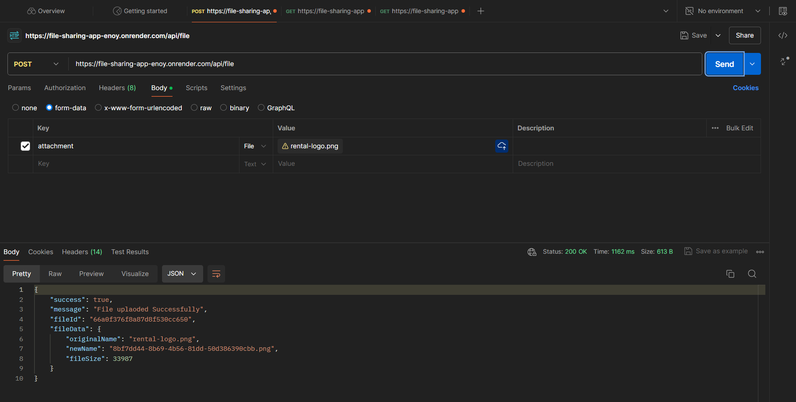
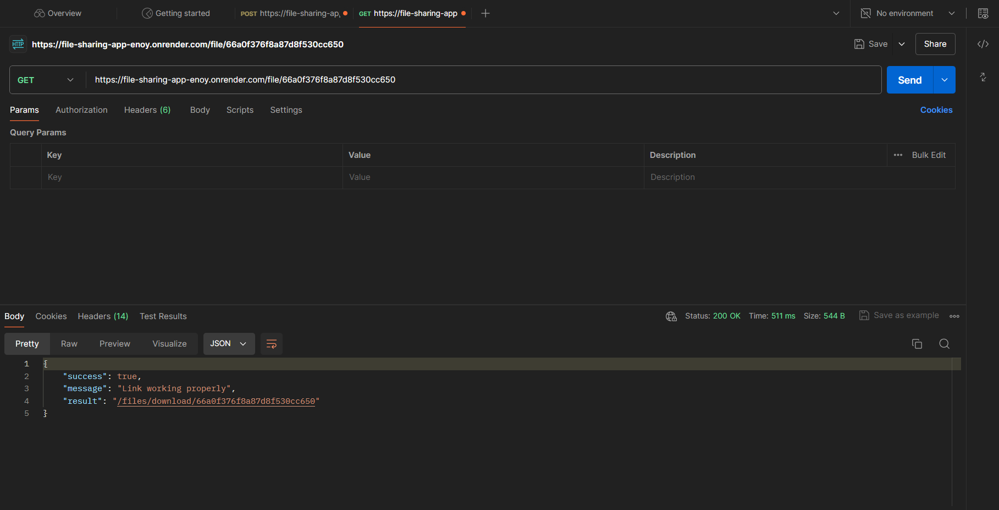
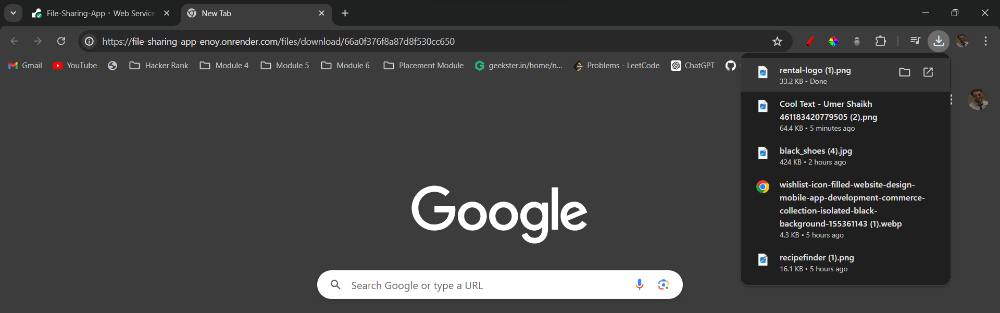

## File Sharing Application

- User Guide

1.  To upload a file go to [https://file-sharing-app-enoy.onrender.com/api/file]

2.  After that it will give you an "fileId" then get the downloadable link using the get through this link [https://file-sharing-app-enoy.onrender.com/file/:fileId]

3.  Downloadable link [https://file-sharing-app-enoy.onrender.com/files/download/:fileId]

- Screenshot reference..

  1. Before putting any file in api

  

  2. After putting the file

  

  3. Getting the data with fileId

  

  4. Using the downloadable link it is downloading the file..(paste the url in Browser)

  

### Try testing the APIs in Postman, Thunderclient or any other platform you want..
